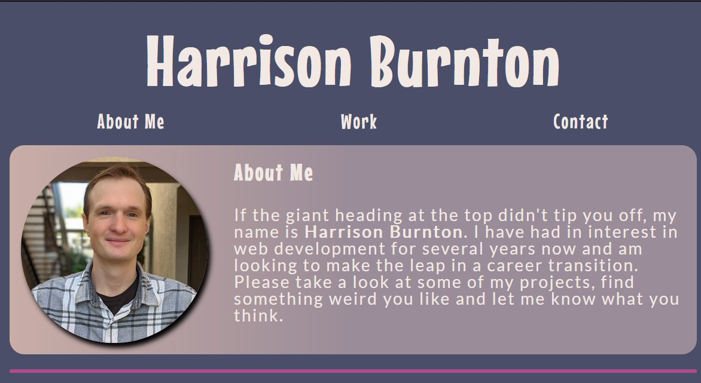

# React Portfolio ⚛

## Description 

Welcome to my React-Based rework of my portfolio. When making this project I set out to understand some of the fundamental concepts of React and dividing previously created html and css from project 2) into something more modern that is more flexible, and modular. 

## Installation

This application is able to be viewed at the live deployment link. Should you wish to download it scripts such as `npm run start` and `npm run build` can be utilized to test and create build version of the application. 

[Live Deployment Link](https://hburnton.github.io/ReactPortfolio/)

## Usage

To use portfolio, look, scroll, click. Be amazed at how something can be restructured using a modern library and look exactly the same.. OOOOH

## Credits

This app/page was built using create-react-app and deployed using react-gh-pages

## Links

[My Github. More interesting projects to be found here](https://github.com/HBurnton)

[Github Link To Project (if you are reading this you've probably already seen this)](https://github.com/HBurnton/ReactPortfolio)

[Live Deployment Link in case you missed it above](https://hburnton.github.io/ReactPortfolio/)